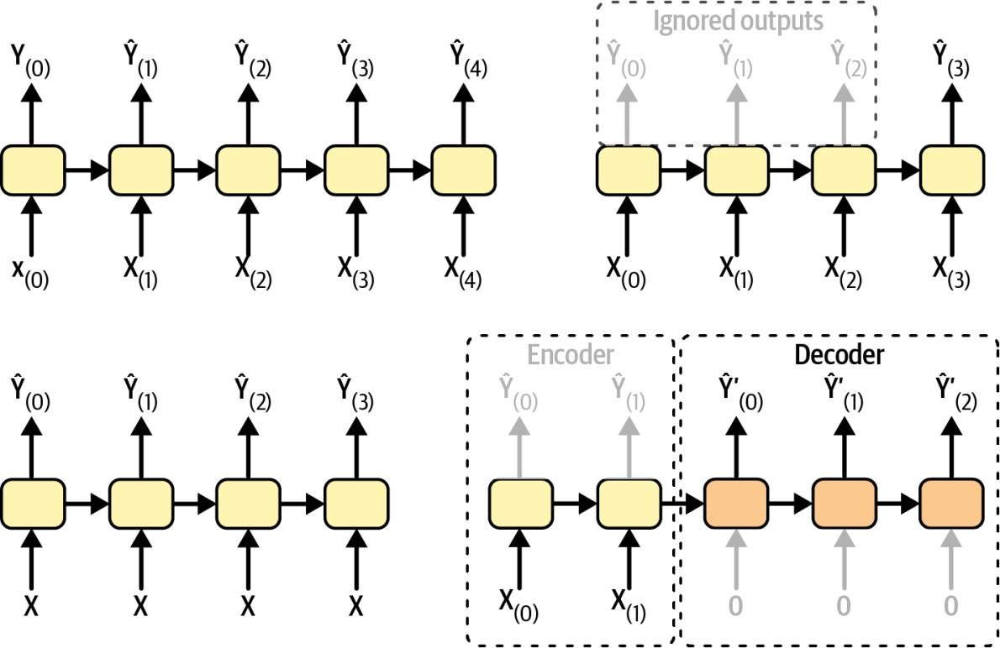
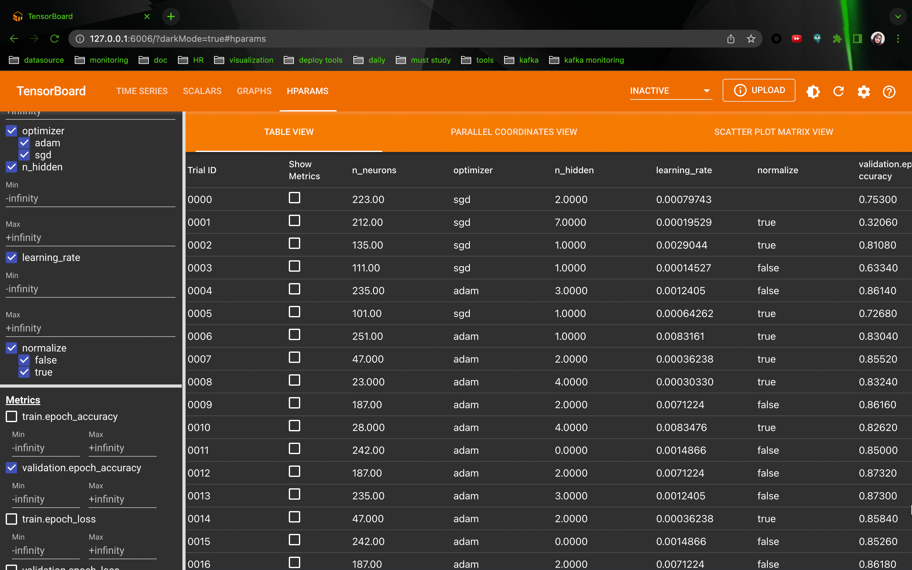
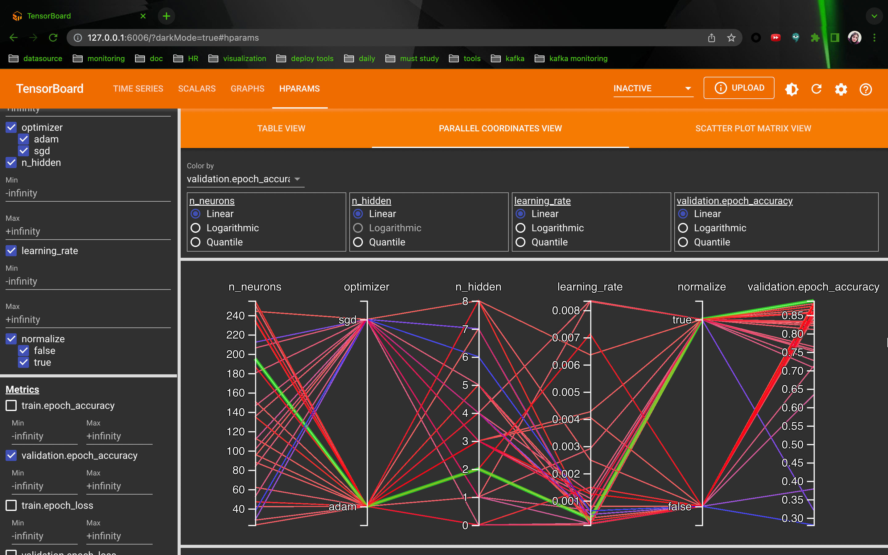
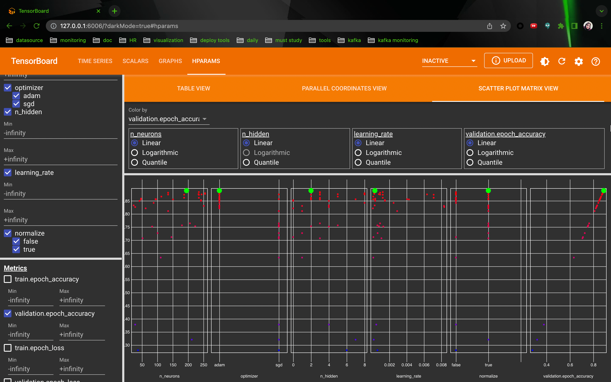

# DNN
## Glorot and He Initialization
They proposed a way to alliviate the unstable gradients problem. We need the signal to flow properly in both direction 
(forward and backward). We dont' want the signal to die out, nor do we want it to explode and saturate. For the signal 
to flow properly, we need the variance of the outputs of each layer to be equal to the variance of its inputs.(Imagine 
a chain of amplifiers, your voice has to come out of each amplifier at the same amplitude as it came in) and we need the 
gradients to have equal variance before and after flowing through a layer in the reverse direction. It is not possible 
unless fan-in = fan-out, but Glorot and Bengio proposed a good compromise that has proven to work very well in practice: 
the connection weights of each layer must be initialized randomly as described below, where: 
$$fan_{avg} = (fan_{in} + fan_{out})/2$$

Normal distribution with mean 0 and variance: $$\sigma^2 = 1/fan_{avg}$$
Or a uniform distribution between $-r$ and $+r$, with $$r = \sqrt{3/fan_{avg}}$$

## Pseudoinverse
Using SVD, we decomposition matrix $X$ into $U \sum V^T$. 
$$X^+ = V \sum^+ U^T$$
To compute $\sum^+$ the algorithm takes $\sum$ and sets to zero all values smaller than a tiny threshold value, then it 
replaces all nonzero values with their inverse and finally it transposes the resulting matrix

## Initialization
| Initialization | Activation functions | $\sigma^2$ (Normal) |
| -------- | -------- | -------- |
| Glorot   | None, tanh, sigmoid, softmax             | $1/fan_{avg}$ |
| He       | ReLU, Leaky ReLU, ELU, GELU, Swish, Mish | $2/fan_{in}$  |
| LeCun    | SELU                                     | $1/fan_{in}$  |

## Clustering Algorithms applications

### Dimensionality reduction
Once a dataset has been clustered, it is usually possible to measure each instance's affinity with each cluster. Each 
instances's feature vector **x** can then be replaces with the vector of its cluster affinities. If there are $k$ 
clusters, then this vector is k-dimensional. The new vector is typically much lower-dimensional but it can preserve 
enough information.

### Feature engineering
The cluster affinites can often be useful as extra features.


## Losses, Optimizers, Activation Functions
We use the "sparse_categorical_crossentropy" loss because we have sparse labels (i.e., for each instance, there is just 
a target class index, from 0 to 9), and classes are exclusive. If instead we had one target probability per class for 
each instance (such as one-hot vectors, e.g., [0, 0, 0, 1, 0, 0, 0, 0, 0, 0] to represent class 3), then we would need 
to use the "categorical_crossentropy" loss instead.

If we were doing binary classification or multilable binary classification, then we would use the "sigmoid" activation 
function in the output layer instead of "softmax" activation function, and we would use the "binary_crossentropy" loss.

## Running TF Serving in a Docker Container
``sh
docker pull tensorflow/serving
``

``sh
docker run -it --rm -v "/home/raha/Desktop/DNN/my_mnist_model:/models/my_mnist_model" -p 8500:8500 -p 8501:8501 -e MODEL_NAME=my_mnist_model tensorflow/serving
``

1. -it: Makes the container interactive and displays the server's output
2. --rm
3. -v: Makes the host's my_mnist_model directory available to the container at the path /models/my_mnist_model
4. -p: The Docker image is configured to use port 8500 to serve the gRPC API and 8501 to serve the REST API by default.
5. -e: Sets the container's MODEL_NAME environment variable, so TF Serving knows which model to serve. By default, it 
6. will look for models in the /models directory and it will automatically serve the latest version it finds.

## Learning rate Scheduling
If you set it slightly too high, it will make progress very quickly at first, but it will end up dancing around the 
optimum and never really settling down

### Power Scheduling
A function of the iteration number, $t: \eta(t) = \eta_0 / (1 + t/s)^c$

### Exponential Scheduling
$\eta(t) = \eta_0 0.1^{t/s}$

### Piecewise Constant Scheduling
Use a constant learning rate for a number of epochs then a smaller learning rate for another number of epochs

### Performance Scheduling
Measure the validation error every N steps and reduce the learning rate by a factor of $\lambda$ when the error stops 
dropping

## Output Layer Activation Function
1. An MLP may not have any activation function for the output layer, so it's free to output any value, this is generally fine.
2. If you want to guarantee that the output will always be positive, then you should use the ReLU activation function in the output layer, or the softplus activation function, which is a smooth variant of ReLU.
3. If you want to guarantee that the predictions will always fall within a given range of values, then you should use the sigmoid function or the hyperbolic tagent and scale the targets to the appropriate range

## Loss Function
1. You usually want mean squared error for regression
2. If you have a lot of outliers in the training set, you may prefer mean absolute error
3. You may want to use Huber loss, which is a combination of both

### Huber Loss
It is quadratic when the error is smaller than a threshold $\delta$ (typically 1) but linear when the error is larger 
than $\delta$. The linear part makes it less sensitive to outliers than the mean squared error, and the quadratic part 
allows it to converge faster and be more precise than the mean absolute error.

## Typical Regression MLP Architecture

| Hyperparameter             | Typical value                                                                     | 
| -------------------------- | --------------------------------------------------------------------------------- |
| # hidden layers            | Typically 1 to 5                                                                  | 
| # neurons per hidden layer | Typically 10 to 100                                                               | 
| # output neurons           | 1 per prediction dimension                                                        | 
| Hidden activation          | ReLU                                                                              | 
| Output activation          | None, or ReLU/softplus (if positive outputs) or sigmoid/tanh (if bounded outputs) | 
| Loss function.             | MSE, or Huber if outliers                                                         | 

# Callbacks
You can combine both ModelCheckpoint and EarlyStopping callbacks to save checkpoints of your model in case your computer 
crashes, and interrupt training early when there is no more progress. The number of epochs can be set to a large value 
then, just make sure the learning rate is not too small, or else it might keep making slow progress until the end.

# Fine-Tuning
## Number of Hidden Layers
An MLP with just one hidden layer can theoretically model even the most complex functions, provided it has enough 
neurons. But for complex problems, deep networks have a much higher parameter efficiency than shallow ones: they can 
model complex functions using exponentially fewer neurons than shallow nets, allowing them to reach much better 
performance with the same amount of training data.

To understand why, suppose you are asked to draw a forest using some drawing software, but you are forbidden to copy and 
paste anything. It would take an enormous amount of time: you would have to draw each tree individually, branch by 
branch, leaf by leaf. If you could instead draw one leaf, copy and paste it to draw a branch, then copy and paste that 
branch to create a tree, and finally copy and paste this tree to make a forest, you would be finished in no time.

Real-world data is often structured in such a hierarchical way, and deep neural networks automatically take advantage of 
this fact: lower hidden layers model low-level structures (e.g., line segments of various shapes and orientations), 
intermediate hidden layers combine these low-level structures to model intermediate-level structures (e.g., squares, 
circles), and the highest hidden layers and the output layer combine these intermediate structures to model high-level 
structures (e.g., faces)

## Number of Neurons per Hidden Layer
As for the hidden layers, it used to be common to size them to form a pyramid with fewer and fewer neurons at each layer
--the rationale being that many low-level features can coalesce into fat fewer high-level features. However, this 
practice has been largely abandoned because it seems that using the same number of neurons in all hidden layers perform 
just as well in most cases, or even better; plus, there is only one hyperparameter to tune, instead of one per layer.
That said, depending on the dataset, it can sometimes help to make the first hidden layer bigger than the others.

### Stretch Pants
Just like the number of layers, you can try increasing the number of neurons gradually until the network starts 
overfitting. Alternatively, you can try building a model with slightly more layers and neurons than you actually need,
then use early stopping and other regularization techniques to prevent it from overfitting too much. A scientist at
Google, has dubbed this the "stretch pants" approach: instead of wasting time looking for pants that perfectly match 
your size, just use large stretch pants that will shrink down to the right size. With this apprach you avoid bottleneck
layers that could ruin your model, Indeed, if a layer has too few neurons it will not have enough representational 
power to preserve all the useful information from the inputs. No matter how big and powerful the rest of the network is, 
that information will never be recovered. In general you will get more bang for your buck by increasing the number of
layers instead of the number of neurons per layer.

## Batch Size
The main benefit of using large batch sizes is that hardware accelerators like GPUs can process them efficiently but large batch sizes often lead to training instabilities, especially at the beginning of training, and the resulting model may not generalize as well as a model trained with a small batch size.


This hierarchical architecture help DNNs:
1. converge faster
2. improves their ability to generalize to new datasets

## Hyperband
It starts by training many different models for few epochs, then it eliminates the worst models and keeps only the 1/factor models, repeating this selection process until a single model is left.

# RNN
Output of a recurrent layer for a single instance
$$y(t) = \phi(W_x^T x(t) + W_y^T y(t-1) + b)$$

## Difficulties
- Unstable gradients which can be alleiviated using various techniques including recurrent dropout and recurrent layer normalization
- A (vary) limited short-term memory, which can be extended using LSTM and GRU cells

For small sequences, a regular dense network and for very long sequences CNNs can work quite well.

Many reseachers prefer to use the tanh activation function in RNNs rather than ReLU.

## Memory Cells
$Y(t)$ is a function of $X(t)$ and $Y(t-1)$ which is a function of $X(t-1)$ and $Y(t-2)$ and so on. This makes $Y(t)$ a 
function of all the inputs since  time = 0.

Since the output of a recurrent neuron at time step $t$ is a function of all the inputs from previous time steps, you 
could say it has a form of memory. A single recurrent neuron, or a layer of recurrent neurons, is a very basic cell, 
capable of learning only short patterns (typically about 10 steps long).

A cell's state ($h(t)$, h stands for hidden) is: $$h(t) = f_1(x(t), h(t-1))$$
Its output is $$y(t) = f_2(x(t), h(t-1))$$
In the case of the basic cells, the output is just equal to the state, but in more complex cells this is not always the 
case.

## Input and Output Sequences
1. sequence-to-sequence network: forcast time series
2. sequence-to-vector network: feed a movie review words and output a sentiment score
3. vector-to-sequence network: captioning an image
4. encoder-decoder: translating a sentence, encoder: sequence-to-vector network, decoder: vector-to-sequence network


## Autocorrelated
When a time series is correlated with a lagged version of itself, we say that the time series is autocorrelated.

## Stationary
Differencing is a common technique used to remove trend and seasonality from a time series: it's easier to study a 
stationary time series, meaning one whose statistical properties remain constant over time, without any seasonality or
trends. Once you're able to make accurate forecasts on the differenced time series, it's easy to turn them into 
forecasts for the actual time series by just adding back the past values that were previously subtracted

## ARMA Model Family
### Differencing
Using differencing over a single time step will produce an approximation of the derivative of the time time series. This means
that it will eliminate any linear trend, transforming it into a constant value. If the original time series has a quadratic trand then two rounds of differencing will eliminate quadratic trends.

### SARIMA
It models the time series in the same way as ARIMA, but it additionally models a seasonal component for a given frequency (e.g. weekly)
using the exact same ARIMA approach.

Good p,q,P and Q values are usually fairly samll (typically 0 to 2, sometimes up to 5 or 6), and d and D are typically 0 or 1, sometimes 2.
There are more principled approaches to selecting good hyperparameters, based on analyzing the ACF and PACF or minimizing AIC or BIC but grid search is a good place to start

## Random Forest
The random forest algorithm introduces extra randomness when growing trees; instead of searching for the very best 
feature when splitting a node, it searches for the best feature among a random subset of features. By default, 
it samples $\sqrt n$ features. The algorithm results in greater tree diversity, which trades a higher bias for a lower 
variance

### Extra Tree
It is hard to tell in advance whether a Random Forest will perform better or worse than an Extra Trees. Generally, the 
only way to know is to try both and compare them.

# Tensorboard
## HPARAMS




# SVM
## C
Reducing C makes the street larger, but it also leads to more margin violation, so there is less risk of overfitting. If
you reduce it too much, then the model ends up underfitting. If your SVM model is overfitting, you can try regularizing 
it by reducing C.
## SVM predict probability
"decision_function" function in SVM measures the signed distance between each instance and the decision boundary.
```python
>>> svm_clf.decision_function(X_new)
array([0.66, -0.22])
```
Unlike LogisticRegression, LinearSVC doesn't have a predict_proba() method to estimate the class probabilities, That 
said, if you use the SVC class instead of LinearSVC, and if you set its probability hyperparameter to True, then the 
model will fit an extra model at the end of training to map the SVM decision function scores to estimated probabilities.
Under the hood, this requires using 5-fold cross-validation to generate out-of-sample predictions for every instance in 
the training set, then training a LogisticRegression model, so it will slow down training considerably. After that, the 
predict_proba() and predict_log_proba() methods will be available.

# Training Models Across Multiple Devices
## Model Parallelism

## Data Parallelism